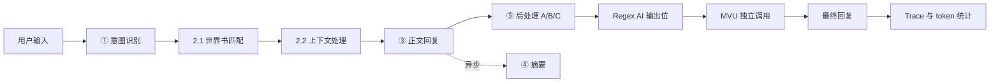

# Agent Loop RP

一个以 DSH Session 能力为基础、面向 SillyTavern 角色扮演场景的多 Agent Harness。

项目的核心目标不是把一条很长的提示词直接交给模型，而是把一次回复拆成多个职责清晰、可以观察和替换的阶段：意图抽取、世界书匹配、上下文筛选、正文生成，以及可选的后处理和变量更新。这样可以独立调整每个阶段的提示词、模型、上下文预算和失败策略。

当前项目仍处于开发阶段，兼容 SillyTavern 的范围是“可运行的安全子集”，不是 SillyTavern 的完整替代品。未实现或不安全的扩展能力会被保留、标记为 inactive/skipped，但不会直接执行。

项目地址：[github.com/2428139739pregnant-web/agent-loop-rp](https://github.com/2428139739pregnant-web/agent-loop-rp)

## 主要能力

- 导入 SillyTavern Character Card V1/V2/V3：PNG、JSON，以及当前兼容范围内的 CHARX 数据。
- 读取角色卡的描述、性格、场景、示例对话、系统提示词、历史后指令、主开场白和多个备选开场白。
- 兼容角色卡内嵌世界书，以及独立的 SillyTavern World Info JSON。
- 支持世界书条目级递归控制、定时效果和包含组选择；确定性规则在本地执行，避免增加额外 LLM 调用。
- 提供三种普通绿灯匹配模式：`ST strict`、`ST enhanced`、`Agent native`。
- 支持角色卡自带的部分 EJS、ST-Prompt-Template 注入指令、Tavern Helper 状态和 MVU 变量处理；HTML 前端边界按 JS-Slash-Runner 的 iframe 规则运行。
- 支持 SillyTavern 风格的 Regex 脚本，区分用户输入、AI 输出、显示文本和世界书位置。
- 支持角色卡 Regex 的 `markdownOnly`/`promptOnly`、宏替换、捕获组清理和深度限制；角色卡生成的 HTML/CSS/内联脚本会在会话区域全宽 sandbox iframe 中显示。
- 支持多个开场白在聊天区域内切换；重 roll 时保留原始用户输入。
- 重 roll 自动复用该轮的意图、世界书和上下文处理结果，只重新生成正文及其后处理。
- SSE 实时显示 Agent 阶段、耗时、输入输出 Trace 和每轮 token 统计。
- 后处理 A/B/C 按链式方式应用编辑；意象抽取可以异步执行，不阻塞用户先看到正文。
- MVU 是独立的额外 LLM 调用，可单独配置模型、温度、提示词和预设。
- 支持 Mock Provider，便于不配置 API Key 时验证导入、会话、UI 和 Agent 链路。

## 工作流程



一次普通回复的阶段含义如下：

1. `intent`：把用户输入整理为 `userNarration`、`metaCommands`、`involvedCharacters` 和 `keywords`。当前意图提示词约定：用 `*...*` 包裹的内容优先视为用户动作、指令或设定；未包裹的内容视为用户说的话。
2. `worldbook`：先根据 SillyTavern 规则处理可以确定的条目，再按当前世界书模式判断普通绿灯候选。最终由本地 Resolver 去重、排序、预算截断并合并来源。
3. `context`：选择历史中的完整片段、摘要片段或丢弃片段，降低正文 Agent 的上下文噪声。
4. `response`：只负责生成角色正文。角色卡被拆成 `persona`、`worldview`、`style` 三个长期可读文档，并在正确位置注入示例对话、系统提示词、历史后指令和世界书结果。
5. `postprocess`：可选的 A 扩写张力、B 感官去重、C 密度收尾。每一步产生的编辑会立即应用到文本，下一步读取上一步的结果；Verify 已移除。
6. `mvu`：如果当前角色卡包含 MVU 状态并且启用 MVU，则使用独立调用分析最终正文并更新变量。它不会替代正文生成，也不会和正文 Agent 共用一条回复路径。
7. `summarize`：摘要在正文完成后异步触发，不阻塞本轮正文返回。

### 重 roll 的处理

重 roll 会先删除当前会话最后一条 assistant 回复，然后从持久化的 `turn-stats.jsonl` 或历史 Trace 中恢复原轮的结构化结果：

- 复用：`intent`、`worldbook`、`context`。
- 重新调用：`response`、后处理、MVU。
- 摘要：随新的正文再次异步触发。
- 复用阶段会在 Trace 中标记为 `reused`，token 成本为 0，不会让前端看起来像重新做了一遍意图识别。

如果旧会话没有可恢复的 Trace，系统会自动退回完整链路，保证旧数据仍然可以使用。

## 环境要求

- Windows、macOS 或 Linux
- Node.js 22 或更高版本
- pnpm 11（项目的 `packageManager` 字段为 `pnpm@11.16.0`）
- 使用真实模型时，需要一个兼容 OpenAI Chat Completions 接口的服务商 API Key。
- 前端通过 import map 从 `esm.sh` 加载 React 18 和 marked，因此首次打开 UI 需要网络访问这些 CDN；后端依赖安装完成后不需要额外构建步骤。

## 安装和启动

在项目根目录执行：

```powershell
cd D:\agent-loop-rp
pnpm install
pnpm start
```

浏览器打开：

```text
http://127.0.0.1:3080
```

### Mock 模式

不配置真实 API 时，使用 Mock Provider 验证 UI 和本地链路：

```powershell
pnpm start:mock
```

Mock 模式不会调用外部 LLM，也不会产生真实模型费用。它适合先测试角色导入、世界书管理、会话、开场白切换、重 roll、Trace 和前端显示。

### 自定义端口和监听地址

```powershell
node --experimental-transform-types scripts/agent-loop-server.mjs --port 3099
node --experimental-transform-types scripts/agent-loop-server.mjs --host 0.0.0.0 --port 3080
```

默认只监听 `127.0.0.1`。只有在确实需要局域网访问时才使用 `--host 0.0.0.0`，并注意 API Key 和角色数据的安全。

### 健康检查

```powershell
Invoke-RestMethod http://127.0.0.1:3080/api/health
```

正常情况下会返回当前 provider、model、角色数量、会话数量等信息。

## 配置真实模型

启动后打开左侧的“模型”面板，选择“OpenAI 兼容”，填写：

- `Base URL`：服务商的 API 根地址，通常以 `/v1` 结尾。
- `API Key`：服务商密钥。
- `Model`：模型名，也可以点击“拉取”从 `${Base URL}/models` 获取模型列表。

以 DeepSeek 为例：

```text
Provider: OpenAI 兼容
Base URL: https://api.deepseek.com/v1
API Key: 你的密钥
Model: deepseek-chat（以模型列表实际返回值为准）
```

点击“保存配置”后，配置会保存到项目根目录的 `api-config.json`。该文件已被 `.gitignore` 排除，不会进入 Git，也不会上传到 GitHub。服务端返回给前端时会遮罩 API Key；输入已保存的密钥时，需要填入新值才会替换旧值。

如果出现 `GET /api/models ... 502`：

1. 检查 Base URL 是否正确，不能重复拼接 `/v1`。
2. 确认服务商能从当前网络访问，并支持 `/models` 和 `/chat/completions`。
3. 确认 API Key 有效且没有多余空格。
4. 可以先切换到 Mock 模式，确认问题只发生在外部模型连接，而不是本地服务。

## 推荐的第一次测试流程

1. `pnpm start:mock` 启动本地服务。
2. 打开左侧“导入”，导入一张角色卡 PNG 或一个角色卡 JSON。
3. 在“角色”面板选择角色，检查三份文档和开场白是否正确。
4. 如果角色卡有多个开场白，在聊天区域右下角选择主开场白或备选开场白。
5. 点击“新建会话”，输入内容后按 `Ctrl+Enter` 发送。
6. 打开“Trace”面板，检查 Agent 阶段和 token 统计。
7. 点击最后一条回复旁的 `🎲` 做重 roll，确认意图、世界书、上下文阶段显示为复用。
8. 再切换到真实模型，先关闭后处理和 MVU，确认正文链路正常后再逐项开启。

## 前端功能面板

| 面板 | 用途 |
| --- | --- |
| 角色 | 查看和切换角色卡，查看三份角色文档、开场白和内嵌世界书状态 |
| 会话 | 新建、切换、重命名和删除本地会话 |
| 模型 | 配置 OpenAI 兼容模型或 Mock，拉取模型，设置正文人称/字数，开关后处理和 MVU |
| Persona | 配置用户名称和用户背景，供 `{{user}}` 和意图/回复上下文使用 |
| 世界书 | 查看角色卡内嵌世界书和独立世界书，切换条目启用状态 |
| 正则 | 创建、编辑、删除和试跑 Regex 脚本 |
| 导入 | 导入 Character Card PNG/JSON |
| 提示词 | 查看和编辑 Agent 提示词模板 |
| Trace | 查看每轮各 Agent 的输入、输出、耗时、调用次数和 token |

发送消息时支持 `Ctrl+Enter`。聊天窗口中的 Markdown 会作为正文区域渲染；存档内容和显示内容分别处理，显示位正则或 `[RENDER:*]` 装饰不会污染后续上下文和重 roll 输入。

## Token 统计和性能设置

每一轮的统计范围是从 user 输入到 assistant 最终回复，Trace 中会分别显示：

- `promptTokens`
- `completionTokens`
- `totalTokens`
- LLM 调用次数
- 是否为估算值
- 是否复用或异步完成

如果服务商返回标准 `usage.prompt_tokens` / `usage.completion_tokens`，统计使用服务商实际值；如果没有返回，则使用本地估算值，并标记“估算”。

后处理面板提供以下设置：

- 总开关：关闭后不运行 A/B/C。
- 轮数：后处理循环轮数，轮数越高耗时越长。
- 密度上限：控制 C 阶段的密度收尾阈值。
- 意象抽取异步执行：正文完成后后台运行，不阻塞用户先看到正文。
- Agent 模型覆盖：可分别为 A、B、C 和意象抽取指定模型。
- 预设：保存和切换后处理参数。

MVU 面板是另一套独立配置：可以单独指定模型、温度、提示词和预设。MVU 的 token 会在 Trace 中记为 `mvu`，不要把它和正文 response 阶段混为一谈。

“回复设置”参考 SillyTavern 预设中的 POV 与 response length block：

  - 人称是可编辑列表：预置跟随角色卡、第一人称、第二人称、第三人称有限视角和第三人称群像；用户可以新增、删除、重命名选项，并直接编辑某个选项实际发送给 response agent 的提示词。
- 字数可选择跟随角色卡、短（200–500 字）、中（500–900 字）、长（1000–1800 字）或自定义区间。
- 字数是 response prompt 的软目标，同时会给 OpenAI-compatible 请求设置 `max_tokens` 安全上限；状态栏、HTML/CSS 和机器标记不计入正文目标。
  - 人称和字数设置停止编辑约 500ms 后自动保存，下一轮 response 会实时使用新值；设置保存到本机 `response-settings.json`，不写回角色卡，也不影响角色卡原始内容。

## SillyTavern 兼容范围

完整的兼容矩阵见：

- [docs/sillytavern-compatibility.md](docs/sillytavern-compatibility.md)
- [docs/ejs-compatibility.md](docs/ejs-compatibility.md)
- [docs/st-adaptation-research.md](docs/st-adaptation-research.md)
- [docs/mvu-pipeline.md](docs/mvu-pipeline.md)

### 角色卡

当前保留和处理的主要字段包括：

- V1/V2/V3 身份、描述、性格、场景。
- `first_mes` 和 `alternate_greetings`。
- `mes_example`。
- `system_prompt`，包括常用的 `{{original}}` 语义。
- `post_history_instructions`。
- V2/V3 `character_book` 的安全子集。
- `{{char}}`、`<char>`、`<bot>` 和 `{{user}}` 的常用替换。

PNG 中同时存在 `ccv3` 和旧 `chara` 元数据时，优先使用 `ccv3`。原始卡片数据会被保存用于后续兼容和导出，但不会把 PNG 原始字节直接塞进模型提示词。

### 世界书模式

| 模式 | 普通绿灯条目 | 特殊插件条目 | 适用场景 |
| --- | --- | --- | --- |
| `ST strict` | 只使用 ST 关键词匹配 | 由本地兼容层处理 | 追求确定性、零额外匹配调用 |
| `ST enhanced` | ST 结果作为基线，Agent 只追加语义候选 | 由本地兼容层处理 | 默认推荐，兼顾兼容性和召回率 |
| `Agent native` | 普通绿灯交给 Agent 判断 | 仍由本地兼容层处理 | 希望更多依赖语义判断 |

蓝灯常驻条目会在角色卡预处理时按位置合并进 `persona`、`worldview` 或 `style`，避免正文阶段重复注入。普通绿灯条目进入动态匹配。最终结果由确定性的本地 Resolver 去重、排序、应用 token 预算，并记录来源是 `st`、`agent`、`st+agent` 还是 `plugin`。

### ST-Prompt-Template 和 Tavern Helper

当前兼容层支持常见的本地可确定行为，包括：

- `@INJECT`。
- `[GENERATE:BEFORE/AFTER]` 和常见 `@@generate_*` 别名。
- `[RENDER:BEFORE/AFTER]` 和常见 `@@render_*` 别名。
- 受限 EJS：条件、循环、输出、角色/用户名、近期消息读取、变量读取、YAML/JSON 辅助等。
- Tavern Helper 的 Session 变量、脚本树和世界书访问的安全子集；变量作用域包含 `global`、`preset`、`character`、`chat`、`message`、`script` 和按 `extension_id` 隔离的 `extension`。
- iframe 变量 API 兼容官方 option：省略 option 时默认为 `chat`，`message` 的 `message_id` 默认为 `latest`，`script` 的 `script_id` 默认为当前 iframe 脚本 ID；`extension` 必须显式传入 `extension_id`。option 会原样随宿主 bridge 传递，message 作用域不会回退为 chat。
- MVU 的初始化、状态读取和变量更新路径。

以下能力目前会保留但不执行，或只执行确定性安全子集：复杂 decorator、动态向量匹配、任意网络请求、文件访问、父页面 DOM 操作、未批准的模块导入、复杂变量写入和依赖宿主 UI 的功能。世界书 `sticky/cooldown/delay`、包含组和条目级全局扫描开关已按 SillyTavern 规则接入会话级确定性处理；普通递归、条目级 scan depth、exclude/prevent/delay recursion 也按确定性规则执行。未支持的部分会记录为 skipped/inactive，避免静默地产生错误结果。

项目底层有两个独立 adapter：`TavernHelperAdapter` 负责角色卡前端 iframe、脚本树、MVU 事件/变量和世界书桥；`PromptTemplateAdapter` 负责 EJS、`[GENERATE:*]`、`[RENDER:*]`、`@INJECT` 和 `[InitialVariables]`。两者都在发送正文前的本地兼容层运行，不会因为适配插件增加 LLM 调用；世界书匹配 Agent 与上下文 Agent 仍然并行。

左侧“扩展”面板提供手动更新、版本激活和回滚。系统只从两个官方仓库的固定 manifest 和 allowlist 文件下载上游快照，写入根目录 `extensions/`，更新时通过临时目录原子替换；上游 bundle 用于版本追踪和后续适配，当前实际执行的仍是项目内审计过的 adapter，不会直接 `eval` 远程代码。可用接口为 `GET /api/extensions`、`POST /api/extensions/check`、`POST /api/extensions/update`、`POST /api/extensions/activate` 和 `POST /api/extensions/rollback`。

### Regex

全局和角色卡 Regex 脚本字段与 SillyTavern 常见命名保持接近：`scriptName`、`findRegex`、`replaceString`、`trimStrings`、`placement`、`disabled`、`markdownOnly`、`promptOnly`、`runOnEdit`、`substituteRegex`、`minDepth`、`maxDepth`。普通脚本先执行，随后按显示/提示词表面执行专用脚本，保证“占位符 → HTML 状态栏”的角色卡写法能正确串起来。

当前支持的 placement：

- `user_input`：进入 Agent 链路前。
- `ai_output`：正文生成和后处理完成后、MVU 分析前。
- `display`：只影响前端显示，不改存档正文。
- `world_info`：世界书相关文本处理。

Regex 执行失败时保留原文，不让单个脚本阻断整轮回复。

角色卡显示结果中的完整 HTML，或包含 `<style>`/`<script>` 的 HTML 片段，会进入独立 sandbox iframe；外部脚本、嵌套 iframe 和父页面访问不属于稳定兼容契约，父层只提供酒馆助手桥接和高度测量。由于布局测量采用同源 iframe fallback，这个兼容运行时应只在本机使用，不要直接暴露到公网。普通 Markdown 仍按 Markdown 渲染，存档正文不会被显示层美化改写。

## 目录结构

```text
agent-loop-rp/
├─ src/
│  ├─ agent-loop/
│  │  ├─ agents/              # intent/worldbook/context/response/postprocess/MVU
│  │  ├─ prompts/              # 各 Agent 的 Markdown 提示词
│  │  ├─ providers/            # DeepSeek/OpenAI-compatible 与 Mock Provider
│  │  ├─ ui-server.ts          # HTTP/SSE 服务、持久化和运行时编排
│  │  ├─ character-loader.ts   # 角色卡预处理与三文档拆分
│  │  ├─ worldbook-*.ts        # 世界书兼容、匹配和插件计划
│  │  └─ *_unit.test.ts        # 单元测试
│  ├─ import/                  # PNG、角色卡、世界书格式解析
│  ├─ ejs-template.ts          # QuickJS 隔离模板运行时
│  ├─ frontend-regex.ts        # 显示/前端 Regex 处理
│  └─ mvu.ts                   # MVU 变量兼容能力
├─ scripts/
│  ├─ agent-loop-server.mjs    # UI 服务启动入口
│  ├─ agent-loop-demo.mjs      # 不依赖 UI 的 Agent Loop 演示
│  └─ agent-loop-ui/           # React 18 + marked 的单页前端
├─ docs/                       # 兼容性、后处理、MVU 和研究说明
├─ package.json
├─ pnpm-lock.yaml
└─ tsconfig.json
```

运行时数据默认放在项目根目录，但已被 `.gitignore` 排除：

```text
api-config.json          # 本地模型配置，含 API Key
characters/              # 导入后的角色卡和预处理结果
worldbooks/              # 独立世界书
worldbook_index/         # 世界书索引
personas/                # 用户 Persona
sessions/                # history、Trace、token 统计
summary/                 # 异步摘要
imagery/                 # 后处理意象数据
ui-server-state.json     # 当前角色、会话等 UI 状态
```

不要把 `api-config.json`、角色卡、会话记录或真实聊天内容提交到公开仓库。

## 开发和测试

安装依赖后执行：

```powershell
pnpm typecheck
pnpm test:agents
node scripts/agent-loop-ui/variable-bridge.unit.test.mjs
```

只运行演示脚本：

```powershell
node --experimental-transform-types scripts/agent-loop-demo.mjs
```

演示脚本默认会根据本地配置选择真实 Provider；没有 API Key 时使用 Mock 或按脚本提示配置。要测试真实模型，建议先在 UI 中完成配置，再从 Mock → 单轮真实回复 → 后处理 → MVU 逐项开启。

提示词可以直接编辑 `src/agent-loop/prompts/*.md`，服务端会在运行时读取；前端的“提示词”面板也可以查看和修改当前覆盖项。修改提示词后不需要编译，但建议重新发起一轮对话确认 Trace 中的实际输入。

## HTTP 接口概览

前端使用同源 HTTP API，普通开发时不需要直接调用接口。常用接口如下：

| 方法 | 路径 | 用途 |
| --- | --- | --- |
| `GET` | `/api/health` | 服务和 Provider 健康状态 |
| `GET` | `/api/state` | 当前角色、会话和 Persona 状态 |
| `GET` | `/api/characters` | 角色列表 |
| `POST` | `/api/import-png` | 导入 PNG 角色卡 |
| `POST` | `/api/import-json` | 导入 JSON 角色卡 |
| `GET` | `/api/worldbooks` | 独立世界书列表 |
| `POST` | `/api/worldbook-import` | 导入 World Info JSON |
| `GET/PUT` | `/api/config` | 读取或保存模型配置 |
| `GET` | `/api/models` | 从 OpenAI-compatible `/models` 拉取模型 |
| `POST` | `/api/session` | 创建会话 |
| `POST` | `/api/run` | 执行一次回复，SSE 模式返回阶段事件 |
| `GET` | `/api/history` | 读取会话历史 |
| `GET` | `/api/sessions/:id/traces` | 读取 Trace 和轮次统计 |
| `GET/PUT` | `/api/worldbook-settings` | 世界书扫描深度和匹配模式 |
| `GET/PUT/POST` | `/api/postprocess-settings` | 后处理设置和预设 |
| `GET/PUT/POST` | `/api/mvu-settings` | MVU 模型、温度和预设 |
| `GET/PUT` | `/api/response-settings` | 正文人称与字数设置 |
| `GET/POST` | `/api/regex` | Regex 脚本管理 |
| `GET` | `/api/extensions` | 查看两个扩展 adapter 和上游版本状态 |
| `POST` | `/api/extensions/check` | 并行检查官方扩展更新 |
| `POST` | `/api/extensions/update` | 手动下载指定扩展的 allowlist bundle |
| `POST` | `/api/extensions/activate` | 激活已下载并校验过的指定版本 |
| `POST` | `/api/extensions/rollback` | 回滚到最近一次安装的其他版本 |

`/api/run` 的 SSE 事件主要包括：

- `stage`：Agent 阶段开始、完成或失败。
- `agent-trace`：该阶段的输入、输出、耗时和 token。
- `error`：本轮错误。

## 常见问题

### 端口被占用

换一个端口启动：

```powershell
node --experimental-transform-types scripts/agent-loop-server.mjs --port 3099
```

然后打开 `http://127.0.0.1:3099`。

### 页面空白或 React 加载失败

前端依赖通过 `esm.sh` 的 import map 加载。检查浏览器网络、代理和 CDN 访问；后端本身可以先用：

```powershell
Invoke-RestMethod http://127.0.0.1:3080/api/health
```

确认服务是否正常。

### 回复很慢

真实模型一轮可能包含多个独立调用。建议按以下顺序定位：

1. 先使用 `pnpm start:mock` 确认本地链路。
2. 真实模型下关闭后处理和 MVU，只测试正文。
3. 世界书模式先使用 `ST strict`，排除额外的语义匹配调用。
4. 后处理轮数设为 1，开启“意象抽取异步执行”。
5. 在 Trace 面板查看究竟是哪个阶段耗时或重复调用。

### 关闭预处理后重 roll 仍然重新识别意图

重 roll 的复用依据是该轮的 `turn-stats.jsonl` 和 `traces.jsonl`。如果是非常早期创建、没有这些结构化记录的旧会话，系统可能退回完整链路；新生成的会话会将 `intent`、`worldbook`、`context` 标记为 `reused`。

### API Key 每次启动都要重新输入

确认“模型”面板中点击过“保存配置”，并检查项目根目录是否生成 `api-config.json`。该文件是本机私有配置，已加入 `.gitignore`；如果使用临时目录、清理脚本或容器运行，需要额外挂载或保留该文件。

## 安全说明

- API Key 只保存在本机的 `api-config.json`，不应提交到 Git。
- 角色卡和会话可能包含私密内容，同样默认不进入 Git。
- EJS、Tavern Helper 和世界书内容来自外部输入，兼容运行时使用受限 QuickJS/沙箱，并对不支持的能力降级为 inactive。
- 不要在没有鉴权和 HTTPS 的情况下把服务暴露到公网。
- 如果 API Key 曾经粘贴到公开聊天、日志或仓库中，应立即撤销并重新生成。

## 相关文档

- [SillyTavern 兼容矩阵](docs/sillytavern-compatibility.md)
- [EJS 兼容范围](docs/ejs-compatibility.md)
- [MVU 独立处理链路](docs/mvu-pipeline.md)
- [后处理管线](docs/postprocess-pipeline.md)
- [SillyTavern 适配研究记录](docs/st-adaptation-research.md)
- [兼容性基准](docs/compatibility-benchmark.md)

## 当前边界

本项目刻意把“兼容数据”和“执行能力”分开：未知字段、未支持的扩展和不安全脚本可以被保留，方便未来迁移，但不会因为导入成功就自动执行。当前实现仍会持续补齐 SillyTavern 预设、酒馆助手、提示词模板、MVU 和世界书的边界行为；如果某个复杂角色卡出现差异，优先查看 Trace、兼容性文档和 skipped/inactive 诊断，而不是直接假设原始卡片丢失。

本仓库目前未声明正式开源许可证，使用和再分发前请先确认项目维护者的许可安排。
